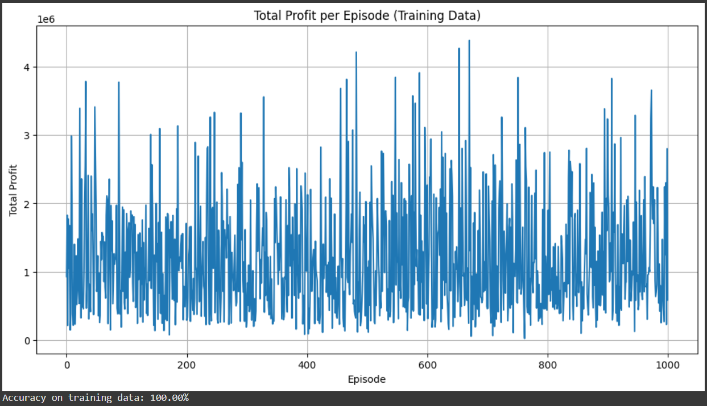
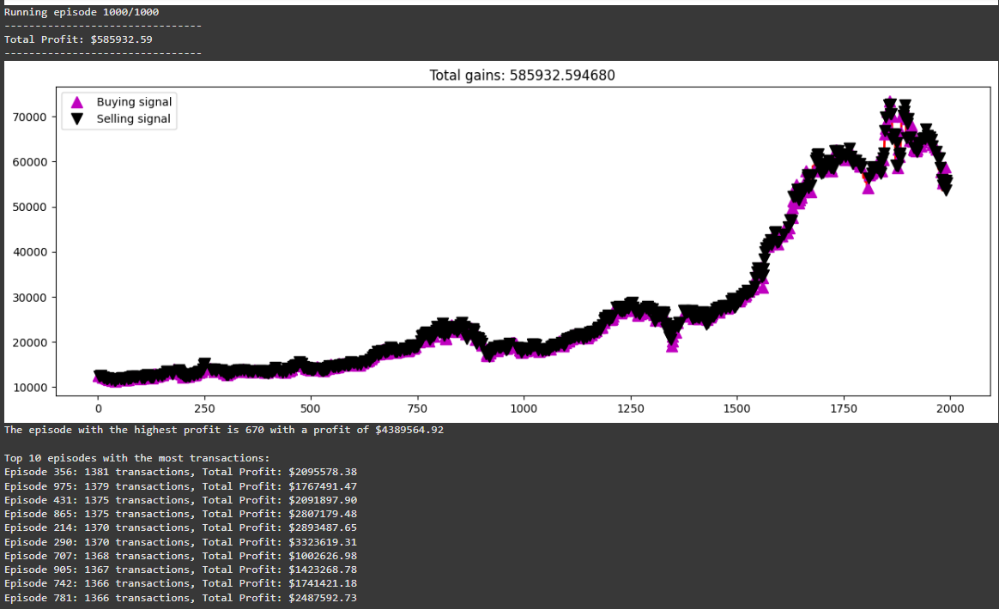
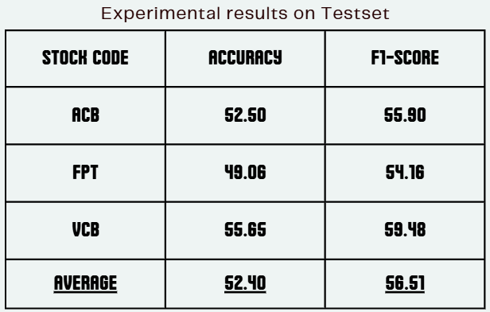
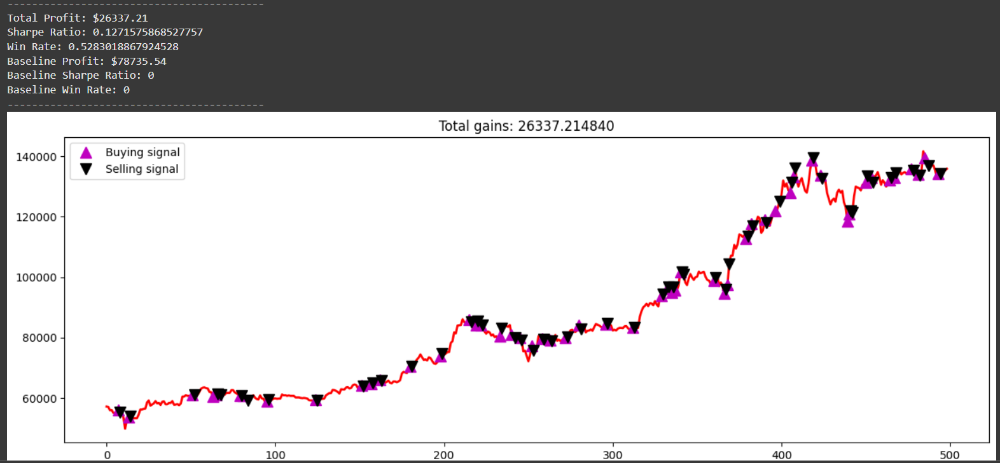

# Stock Trading using Reinforcement Learning

## Project Overview
This project explores building a reinforcement learning (RL) model to predict stock price trends and make optimal trading decisions on the Vietnamese stock market. Using Q-learning, a model-free RL algorithm, the project aims to develop an agent that maximizes profit through buy, sell, or hold decisions within a simulated trading environment.

## Authors
- **Hoàng Thanh Lâm** - QE170013
- **Trương Phước Trung** - QE170090
- **Trương Quyết Thắng** - QE170008
- **Trần Tiến Đạt** - QE170053
- **Dương Thành Duy** - QE170105

## Project Structure
- **Introduction**: Discusses the motivation behind using reinforcement learning in stock trading, particularly within the Vietnamese stock market, where traditional investment methods are being supplemented by algorithmic trading.
- **Research Objectives**: Develop a model for predicting daily stock price trends in Vietnamese markets.
- **Model**: Uses Q-learning with a neural network architecture to approximate Q-values and optimize trading decisions.
- **Data**: Historical stock data of three companies (ACB, FPT, VCB) from Yahoo Finance, covering 10 years.
- **Implementation**: Model trained with historical data and evaluated on its accuracy, profit generation, Sharpe ratio, and win rate.

## Dataset
The dataset comprises stock price data (Date, Open, Low, High, Volume) for three companies: ACB, FPT, and VCB. Data is collected from Yahoo Finance and covers the period from November 1, 2014, to October 31, 2024. Only the closing price is used for model input.

## Model Architecture
- **Q-Learning Agent**: The agent uses a neural network with three dense layers:
  - **Input Layer**: 64 neurons
  - **Hidden Layers**: 32 and 8 neurons respectively
  - **Output Layer**: 3 neurons representing Q-values for actions (buy, sell, hold)
  
- **Hyperparameters**:
  - Discount factor (`gamma`): 0.95
  - Exploration rate (`epsilon`): Starts at 1.0
  - Batch size: 32
  - Episodes: 1000

## Performance Metrics
1. **Total Profit**: Cumulative financial gains over the trading period.
2. **Sharpe Ratio**: Risk-adjusted return metric.
3. **Win Rate**: Percentage of profitable trades.
4. **Baseline Metrics**: Comparison metrics including a passive "buy and hold" strategy.

## Results
- **Training on FPT**: Achieved accuracy of 100% in training.

- **Testing on FPT**: Generated a total profit of $26337.21 with a win rate of 52.83%, outperforming the baseline profit.

## How to Use
- **Read file Code.ipynb**

## Pros and Cons
- **Pros**:
  - Adaptable to changing market conditions.
  - Suitable for decision-making tasks in complex environments.
- **Cons**:
  - High computational cost.
  - Slow convergence in real-time scenarios.

## Future Improvements
- Use advanced models like Deep Q-Networks (DQNs) for better performance.
- Perform hyperparameter optimization for enhanced stability and accuracy.

## References
1. Dang, Q. (2024). Data collection strategies in financial research.
2. Fama, E. F. (1965). The Behavior of Stock-Market Prices.
3. Mnih, V., et al. (2015). Human-level control through deep reinforcement learning.
4. Sutton, R. S., & Barto, A. G. (2018). Reinforcement Learning: An Introduction.
